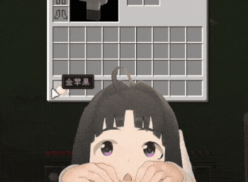

# RedFoxExpand

[](https://creativecommons.org/licenses/by-nc-sa/4.0/)
[](https://www.minecraft.net/)
[](https://www.oracle.com/java/)
[](https://files.minecraftforge.net/)
[](#)
[](https://github.com/kyeitk/RedFoxExpand/actions)
[](#)

RedFoxExpand 是由 **RedFox团队** 开发的 Minecraft **1.8.9 Forge** 客户端 Mod。它允许材质包作者通过
JSON 修改容器 GUI 的尺寸、位置、Slot、贴图和文字，并使用响应式状态、动画与场景图构建动态界面。

- 当前版本：`0.2.2`（Git Tag：`v0.2.2-mc1.8.9`）
- Minecraft：`1.8.9`
- Forge：`11.15.1.2318`
- Java：`8`
- 运行端：仅客户端

## 项目实例演示



## 功能状态

### 已实现

- 兼容旧 `assets/Kyeitk/` v1 配置及旧 Polytone GUI modifier 回退路径；
- 支持小写原生 manifest，以及严格的 Schema v2、v3 和 v3.1 配置；
- 支持 `append`、`replace`、`disable`、Definition priority 与稳定资源包优先级；
- 支持屏幕类、容器类、标题及 `all/any/not` 组合匹配；
- 支持 GUI 位置/尺寸、Slot 位移与渐变高亮、静态文字和文字规则；
- 支持整图、区域 UV、资源定位、材质包纹理、三种渲染层和帧动画；
- 支持 PNG Alpha，并在绘制结束后恢复 OpenGL 颜色、混合、Alpha、深度、纹理、裁剪和矩阵状态；
- Schema v3 提供稳定 Sprite ID、Expression Engine、Runtime Context、Binding、Event、Behavior、Action
  与 Property Animation；
- Runtime Context 提供玩家血量、燃烧、潜行、疾跑、护甲、饥饿、空气、经验、屏幕、GUI、鼠标及按键状态；
- 支持 `visible`、`alpha`、平移、缩放和旋转属性，以及平滑、`linear` / `smoothstep` 插值；
- Schema v3.1 新增统一 `elements`、Sprite/Group、Parent/Child 场景树、局部坐标和父级变换、显隐、透明度继承；
- 支持 GUI/Screen 九点 Anchor、Element Pivot，以及稳定的 `layer → z → scene order`；
- 支持 Definition-local `constants`、按声明顺序求值的 `values`，以及 Binding 中的
  `self.*` / `parent.*` 基础布局几何；
- 属性动画支持显式 `replace` / `add` / `multiply` 合成，Group 可作为 Binding、Animation 和 Action target；
- 每个 `GuiContainer` 使用独立响应式运行时，关闭界面、玩家变化、重新布局或 F3+T 后释放旧瞬时状态；
- 材质包切换时只清理由 RedFoxExpand 创建的原生纹理缓存，不影响原版或其他 Mod 的共享纹理。

### 下一步

- 更清晰的结构化诊断与离线 Validator；
- 面向材质包作者的 Inspector 与属性管线视图；
- Layout Container、Clip/Scroll 与 Component 复用；
- Semantic Slot，以及 Text/Slot 的响应式 target；
- HUD API 与 Widget；
- Texture State、width/height/color Binding 与更多安全事件和动作；
- 可读取并导出正式 Schema JSON 的可视化编辑器。

完整状态和边界见 [`docs/FEATURES.md`](docs/FEATURES.md)。

## 项目方向

RedFoxExpand 的核心设计哲学是：

> **让资源包负责表现，让 Mod 负责能力。**

资源包使用 Texture、Layout、Animation、Color、Visibility、Style 与 Theme 描述界面；Mod 负责 State、
Rendering、Events、Input、Compatibility、Security 与 Runtime。目标不是简单支持更多 PNG，而是让材质包作者
只使用 PNG、JSON、Animation、Expression 和 Components，也能制作动态背包、动态 HUD、RPG/PvP/科幻界面、
角色面板、响应式 GUI 与第三方 Mod UI。

```text
Resource Pack API ─┐
                   ├─> Expression Engine -> UI Definition -> HUD / GUI / Components
Runtime Context  ──┘                                      -> Layout Engine
                                                          -> Animation Engine
                                                          -> Render Pipeline -> Minecraft
```

项目将从“材质包辅助 Mod”继续发展为 **Minecraft Resource Pack UI Framework**，并最终形成可复用的
**Minecraft Resource Pack UI Runtime**。Schema v3.1 已让复杂界面从平铺 Sprite 进入 Scene Graph；下一阶段
优先改善诊断、Inspector、布局与复用能力，再在同一核心上扩展 Semantic Slot、HUD 和 Widget。

## 安装

1. 安装 Minecraft 1.8.9、Forge `11.15.1.2318` 与 Java 8；
2. 从 [GitHub Releases](https://github.com/kyeitk/RedFoxExpand/releases) 下载
   `RedFoxExpand-1.8.9-0.2.1.jar`；
3. 将 JAR 放入 Minecraft 实例的 `mods/` 目录；
4. 启动游戏并启用符合 v1、Schema v2、v3 或 v3.1 的 RedFoxExpand 材质包。

Mod 不要求服务端安装。新增或修改资源包配置后可按 F3+T 重新加载。

## Schema v2/v3/v3.1 目录

```text
MyPack/
├─ pack.mcmeta
└─ assets/
   └─ kyeitk/
      └─ redfoxexpand/
         ├─ index.json
         ├─ config/
         │  └─ inventory.json
         └─ textures/
            └─ gui/
               └─ character.png
```

Minecraft 1.8.9 的 `pack.mcmeta` 使用 `pack_format: 1`：

```json
{
  "pack": {
    "pack_format": 1,
    "description": "My RedFoxExpand pack"
  }
}
```

`assets/kyeitk/redfoxexpand/index.json`：

```json
{
  "api_version": 3.1,
  "configs": ["redfoxexpand/config/inventory.json"]
}
```

manifest 的 `api_version` 可为严格数值 `2`、`3` 或 `3.1`，并决定其全部 config 版本。版本必须完全一致，
字符串 `"3.1"` 无效。manifest 中的 config 必须来自同一个资源包。

## Schema v3 响应式界面

需要根据玩家或界面状态动态改变 Sprite 时，将 manifest 与 config 的 `api_version` 都设为 `3`，并为每个
Sprite 提供 Definition 内唯一的 `id`：

```json
{
  "api_version": 3,
  "definitions": [{
    "id": "example:reactive_inventory",
    "match": {"exact_menu_class":"net.minecraft.inventory.ContainerPlayer"},
    "sprites": [{
      "id": "fire",
      "texture": {"type":"pack_resource","location":"textures/gui/fire.png"},
      "anchor": "gui", "x": 80, "y": 20, "width": 32, "height": 32
    }],
    "bindings": [
      {"target":"fire","property":"visible","value":"player.is_burning"},
      {"target":"fire","property":"translate_x","value":"mouse.gui_x - 80","smoothing_ms":120}
    ]
  }]
}
```

v3 表达式在资源重载时预编译并严格校验，不支持脚本、反射、文件、网络或任意函数调用。完整 Runtime Context、
表达式语法、属性、事件、动画、行为和预算见 [`docs/SCHEMA_V3.md`](docs/SCHEMA_V3.md)。

## Schema v3.1 场景图

Schema v3.1 面向由多个图层组成的角色、面板和动态界面。将 manifest 与 config 的 `api_version` 都设为
数值 `3.1`，使用统一 `elements` 数组，并通过 Group 组织可共同移动、缩放、旋转、显隐或改变透明度的子树：

```json
{
  "api_version": 3.1,
  "definitions": [{
    "id": "example:character",
    "match": {"exact_menu_class":"net.minecraft.inventory.ContainerPlayer"},
    "constants": {"turn_limit": 4},
    "values": {
      "head_turn": "clamp((mouse.x - screen.width / 2) * 0.01, -turn_limit, turn_limit)"
    },
    "elements": [
      {
        "id":"character_root", "type":"group",
        "anchor":"screen_bottom_center", "x":-80, "y":-160,
        "width":160, "height":160,
        "children":["body", "head_group"]
      },
      {
        "id":"body", "type":"sprite",
        "texture":{"type":"pack_resource","location":"textures/gui/body.png"},
        "width":160, "height":160, "layer":"foreground"
      },
      {
        "id":"head_group", "type":"group", "width":160, "height":160,
        "children":["head"]
      },
      {
        "id":"head", "type":"sprite",
        "texture":{"type":"pack_resource","location":"textures/gui/head.png"},
        "width":160, "height":160, "layer":"foreground"
      }
    ],
    "bindings": [{
      "target":"head_group", "property":"rotation_z",
      "value":"head_turn", "smoothing_ms":180
    }]
  }]
}
```

根 Element 可使用 GUI/Screen 九点 Anchor，子 Element 使用父级局部坐标；Pivot 决定旋转和缩放中心。
Constants 消除重复数字，Derived Values 复用表达式，`self.*` / `parent.*` 为鼠标跟随等效果提供稳定基础
几何。完整字段、默认值、场景继承、动画合成和 v3.0 迁移步骤见
[`docs/SCHEMA_V3_1.md`](docs/SCHEMA_V3_1.md)。

## v1 兼容目录

既有资源包仍可使用：

```text
assets/Kyeitk/config/**/*.json
assets/Kyeitk/textures/**
```

v1 文件继续使用 `target_type`、`target`、`class_match`、`custom_textures` 等旧字段。大写 `Kyeitk` 是
历史兼容入口，不是 v2/v3/v3.1 原生 manifest 路径。

## 开发者构建

项目使用 ForgeGradle 2.1，要求 JDK 8。

```powershell
$env:JAVA_HOME = 'C:\Path\To\JDK8'
$env:Path = "$env:JAVA_HOME\bin;$env:Path"
.\gradlew.bat clean build --no-daemon --console=plain
```

发布 JAR：

```text
build/libs/RedFoxExpand-1.8.9-0.2.1.jar
```

## 文档

- [功能状态与实现边界](docs/FEATURES.md)
- [材质包开发者 API](docs/resourcepack-api.md)
- [Schema v3 响应式 UI 协议](docs/SCHEMA_V3.md)
- [Schema v3.1 场景图与创作协议](docs/SCHEMA_V3_1.md)
- [GUI 静态、动画与 Alpha 格式](docs/GUI_RESOURCE_FORMAT.md)
- [材质包目录与迁移规范](docs/RESOURCE_PACK_STRUCTURE.md)
- [任意位置自定义贴图](docs/custom-textures.md)
- [破限背包实现逻辑](docs/break-limit-inventory.md)
- [更新日志](CHANGELOG.md)

## 当前限制

- 当前仅处理 Minecraft 1.8.9 Forge 客户端的容器 GUI，HUD 与 Widget 尚未实现；
- 1.8.9 没有现代注册表化 GUI 标识，`menu_type`、matcher `resource_location`、`mod_namespace` 不可用；
- v3.0 Reactive target 仅为 Sprite；v3.1 target 可为 Sprite 或 Group；
- Schema v3.1 Scene Graph 当前只作用于 Sprite/Group，Text 和 Slot 尚不能进入场景树或作为响应式 target；
- 不支持 Semantic Slot、Layout Container、Component、Clip/Scroll 或 Inspector；
- 尚无 Texture State、width/height/color Binding、自定义变量/事件、Timer、User Function、循环/递归或
  `every.mode=repeat`；
- `self.*` / `parent.*` 提供静态基础布局几何，不读取本帧 Binding/Animation 后的最终矩阵；
- Minecraft 1.8.9 原版没有 Recipe Book，因此该能力不适用于此分支；
- 第三方 Mod GUI、不同 GUI Scale 与渲染 Mod 组合的表现可能因环境而异。

## 许可

当前仓库遵循 `CC BY-NC-SA 4.0` 协议；除非权利人另行授权，源代码默认保留所有权利。仓库不包含
第三方材质包或受限制美术素材。
